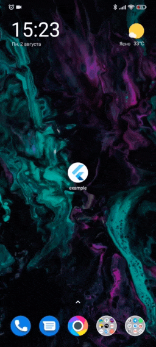
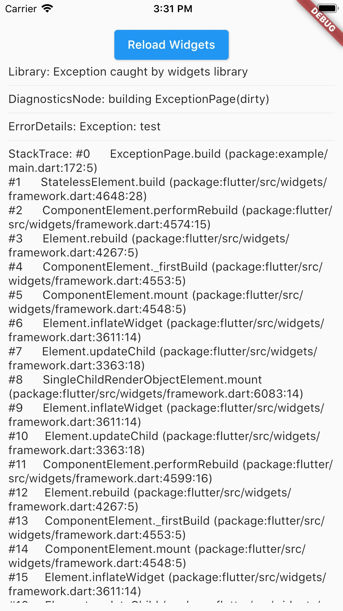

<h1 align="center">AppRunner</h1>

<a href="https://madbrains.ru/"></a>

[](https://pub.dartlang.org/packages/app_runner)
[](https://opensource.org/licenses/MIT)

Launch your Flutter app like a pro! AppRunner is a configurator for quick and controlled launch of your application, with features that runApp does not have.

## Features
* Get your application up and running quickly.
* Allows you to run code without blocking your application from launching.
* Show your independent splash screen while loading the app. AppRunner does not block the first call of the widget, do you practically won't see the native splash screen.
* Allows you to reload the widget tree if you need it.
* Your code will run in a safe environment for both Dart code and Flutter code. AppRunner catches and handles errors, preventing your application from breaking at runtime.
* Configuring the zone of your application is much easier.
* With AppRunner you can easily override ErrorWidget for debug and release mode.
* Lets you just use your WidgetsBinding implementation.
* And the very last and most important argument to use AppRunner in your application, it is very easy to integrate into your application, and its configuration does not take much time.

<table>
  <tr>
    <td>Splash Screen</td>
    <td>Debug Error Screen</td>
    <td>Release Error Screen</td>
  </tr>
  <tr>
    <td></td>
    <td></td>
    <td></td>
  </tr>
</table>

## Installing
Add this to your package's `pubspec.yaml` file:
```yaml
dependencies:
  app_runner: 1.0.0
```

## Usage

This is how your application launch looked like before:
```dart
import 'package:flutter/material.dart';

void main() {
  runApp(MyApp());
}
```

It is simply by attaching your widget to the root. But in order to catch errors, it was necessary to use runZonedGuarded, then our code will become like this:
```dart
import 'dart:async';

import 'package:flutter/material.dart';

void main() {
  runZonedGuarded<void>(
    () {
      runApp(MyApp());
    },
    (Object error, StackTrace stackTrace) {...},
    zoneValues: ...,
    zoneSpecification: ...,
  );
}
```

But we also need to initialize some code to launch the application, for example Firebase:
```dart
import 'dart:async';

import 'package:flutter/material.dart';
void main() {
  runZonedGuarded<void>(
    () async {
      WidgetsFlutterBinding.ensureInitialized();

      await Firebase.initializeApp();

      HydratedBloc.storage = await HydratedStorage.build(
        storageDirectory: await getApplicationDocumentsDirectory(),
      );

      Bloc.observer = MyBlocObserver();

      runApp(MyApp());
    },
    (Object error, StackTrace stackTrace) {},
    zoneValues: ...,
    zoneSpecification: ...,
  );
}
```

And what do we have:
* The launch of the widget is blocked by the third-party code.
* The splash screen is implemented in MyApp, that is, it will be present in the tree when it is no longer needed.
* Not the most beautiful and understandable code.

Let's fix this with AppRunner (all possible parameters are shown here, it is not necessary to use all of them):
```dart
import 'package:app_runner/app_runner.dart';
import 'package:flutter/material.dart';

void main() {
  appRunner(
    RunnerConfiguration(
      widgetConfig: WidgetConfiguration(
        app: MyApp(), // Our application
        splash: const Splash(), // Our splash screen
        errorBuilder: (BuildContext context, FlutterErrorDetails errorDetails) => MyErrorScreen(errorDetails), // Our flutter error screen during debugging
        releaseErrorBuilder: (BuildContext context) => MyReleaseErrorScreen(), // Our flutter error screen during release
        onFlutterError: (FlutterErrorDetails errorDetails) {
          // Flutter error handling
          dev.log(errorDetails.toString(),
              name: 'onFlutterError', stackTrace: errorDetails.stack);
        },
        initializeBinding: () => CustomWidgetsFlutterBinding(), // Creating your WidgetsFlutterBinding
      ),
      zoneConfig: ZoneConfiguration(
        onZoneError: (Object error, StackTrace stackTrace) {
          // Dart error handling
          dev.log(error.toString(),
              name: 'onZoneError', stackTrace: stackTrace);
        },
        zoneValues: ..., // Your zone parameters
        zoneSpecification: ..., // Your zone specifications
      ),
      preInitializeFunctions: (WidgetsBinding binding) async {
        // Custom code initialization.
        // You don't need to call WidgetsFlutterBinding.ensureInitialized();
        // WidgetsBinding is also available here if you need it.

        await Firebase.initializeApp();

        HydratedBloc.storage = await HydratedStorage.build(
          storageDirectory: await getApplicationDocumentsDirectory(),
        );

        Bloc.observer = MyBlocObserver();
      },
    ),
  );
}
```

If you need to reload the widgets, you can do:
```dart
reloadWidget(context);

// or

context.reloadWidget();
```

## Example
The [Example][example] is in the corresponding folder

[example]: https://github.com/MadBrains/App-Runner-Flutter/tree/main/example/
