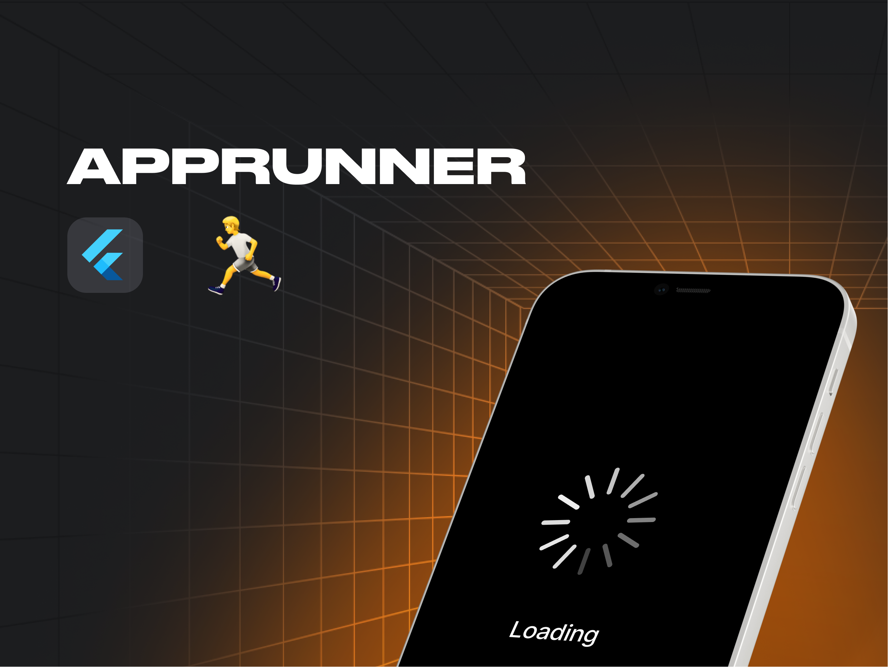
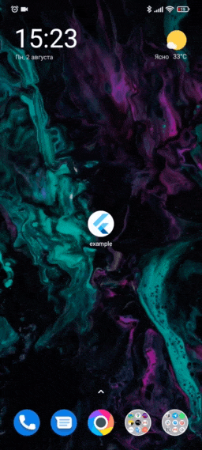
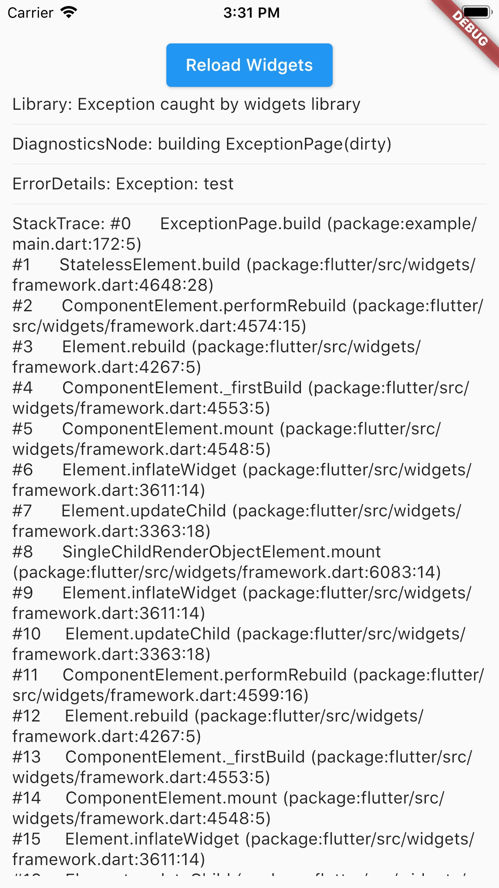

<a href="https://madbrains.ru/?utm_source=gthb"></a>
</a>

<h1 align="center">AppRunner</h1>

[](https://pub.dartlang.org/packages/app_runner)
[](https://opensource.org/licenses/MIT)

Launch your Flutter app like a pro! AppRunner is a configurator for quick and controlled launch of your application, with features that runApp does not have.


<p><h4> We solve problems of brand presence on mobile devices, specializing in development of mobile applications and services in the b2c segment.</h4>
<a href="https://madbrains.ru/?utm_source=gthb">
</a>
</p>

<p><h5>Subscribe for the latest updates:</h5>
<a href="https://github.com/MadBrains" >
</a></p>
</br>

## Features
* Get your application up and running quickly.
* Allows you to run code without blocking your application from launching.
* Show your independent splash screen while loading the app. AppRunner does not block the first call of the widget, do you practically won't see the native splash screen.
* Allows you to reload the widget tree if you need it.
* Your code will run in a safe environment for both Dart code and Flutter code. AppRunner catches and handles errors, preventing your application from breaking at runtime.
* Configuring the zone of your application is much easier.
* With AppRunner you can easily override ErrorWidget for debug and release mode.
* Lets you just use your WidgetsBinding implementation.
* And the very last and most important argument to use AppRunner in your application, it is very easy to integrate into your application, and its configuration does not take much time.

<table>
  <tr>
    <td>Splash Screen</td>
    <td>Debug Error Screen</td>
    <td>Release Error Screen</td>
  </tr>
  <tr>
    <td></td>
    <td></td>
    <td></td>
  </tr>
</table>

## Installing
**BREAKING**: Note, starting with version 2.1.0, Flutter 3.0.0+ is used by default. If you need to use a Flutter version lower than 3.0.0, then use package version 2.0.0 and below.

Add this to your package's `pubspec.yaml` file:
```yaml
dependencies:
  app_runner: <last version>
```

## Usage

This is how your application launch looked like before:
```dart
import 'package:flutter/material.dart';

void main() {
  runApp(MyApp());
}
```

It is simply by attaching your widget to the root. But in order to catch errors, it was necessary to use runZonedGuarded, then our code will become like this:
```dart
import 'dart:async';

import 'package:flutter/material.dart';

void main() {
  runZonedGuarded<void>(
    () {
      runApp(MyApp());
    },
    (Object error, StackTrace stackTrace) {...},
    zoneValues: ...,
    zoneSpecification: ...,
  );
}
```

But we also need to initialize some code to launch the application, for example Firebase:
```dart
import 'dart:async';

import 'package:flutter/material.dart';
void main() {
  runZonedGuarded<void>(
    () async {
      WidgetsFlutterBinding.ensureInitialized();

      await Firebase.initializeApp();

      HydratedBloc.storage = await HydratedStorage.build(
        storageDirectory: await getApplicationDocumentsDirectory(),
      );

      Bloc.observer = MyBlocObserver();

      runApp(MyApp());
    },
    (Object error, StackTrace stackTrace) {},
    zoneValues: ...,
    zoneSpecification: ...,
  );
}
```

And what do we have:
* The launch of the widget is blocked by the third-party code.
* The splash screen is implemented in MyApp, that is, it will be present in the tree when it is no longer needed.
* Not the most beautiful and understandable code.

Let's fix this with AppRunner (all possible parameters are shown here, it is not necessary to use all of them):
```dart
import 'package:app_runner/app_runner.dart';
import 'package:flutter/material.dart';

void main() {
  final WidgetConfiguration widgetConfiguration = WidgetConfiguration(
    child: AppBuilder<String>(
      preInitialize: (WidgetsBinding binding) async {
        // Custom code initialization.
        // You don't need to call WidgetsFlutterBinding.ensureInitialized();
        // WidgetsBinding is also available here if you need it.

        await Firebase.initializeApp();

        HydratedBloc.storage = await HydratedStorage.build(
          storageDirectory: await getApplicationDocumentsDirectory(),
        );

        Bloc.observer = MyBlocObserver();
        
        return 'Mad Brains';
      },
      // Our application
      builder: (
        BuildContext context,
        AsyncSnapshot<String?> snapshot,
        Widget? child,
      ) {
        late final Widget _child;
        switch (snapshot.connectionState) {
          case ConnectionState.none:
          case ConnectionState.active:
          case ConnectionState.waiting:
            _child = const Splash(); // show Splash
            continue display;
          case ConnectionState.done:
            final String? data = snapshot.data; // data from preInitialize
            log(data);
            _child = const MyApp(); // show App
            continue display;
          display:
          default:
            return AnimatedSwitcher(
              duration: const Duration(milliseconds: 150),
              child: _child,
            );
        }
      },
    ),
    errorBuilder: (BuildContext context, FlutterErrorDetails errorDetails) => MyErrorScreen(errorDetails), // Our flutter error screen during debugging
    releaseErrorBuilder: (BuildContext context) => MyReleaseErrorScreen(), // Our flutter error screen during release
    onFlutterError: (FlutterErrorDetails errorDetails) {
      // Flutter error handling
      log(
        errorDetails.toStringShort(),
        name: 'onFlutterError',
        stackTrace: errorDetails.stack,
        error: errorDetails.exception,
      );
    },
    initializeBinding: () => CustomWidgetsFlutterBinding(), // Creating your WidgetsFlutterBinding
  );

  final ZoneConfiguration zoneConfiguration = ZoneConfiguration(
    onZoneError: (Object error, StackTrace stackTrace) {
      // Dart error handling
      log(
        error.runtimeType.toString(),
        name: 'onZoneError',
        stackTrace: stackTrace,
        error: error,
      );
    },
    zoneValues: ..., // Your zone parameters
    zoneSpecification: ..., // Your zone specifications
  );

  appRunner(
    kIsWeb
        ? RunnerConfiguration(
            widgetConfig: widgetConfiguration,
            // optional, isolate error handling
            onPlatformError: (Object exception, StackTrace stackTrace) {
              log(
                exception.runtimeType.toString(),
                name: 'onPlatformError',
                stackTrace: stackTrace,
                error: exception,
              );

              return false;
            },
          )
        : RunnerConfiguration.guarded(
            widgetConfig: widgetConfiguration,
            zoneConfig: zoneConfiguration,
          ),
  );
}
```

If you need to reload the widgets, you can do:
```dart
reloadWidget(context);

// or

context.reloadWidget();
```

## Example
The [Example][example] is in the corresponding folder

[example]: https://github.com/MadBrains/App-Runner-Flutter/tree/main/example/

